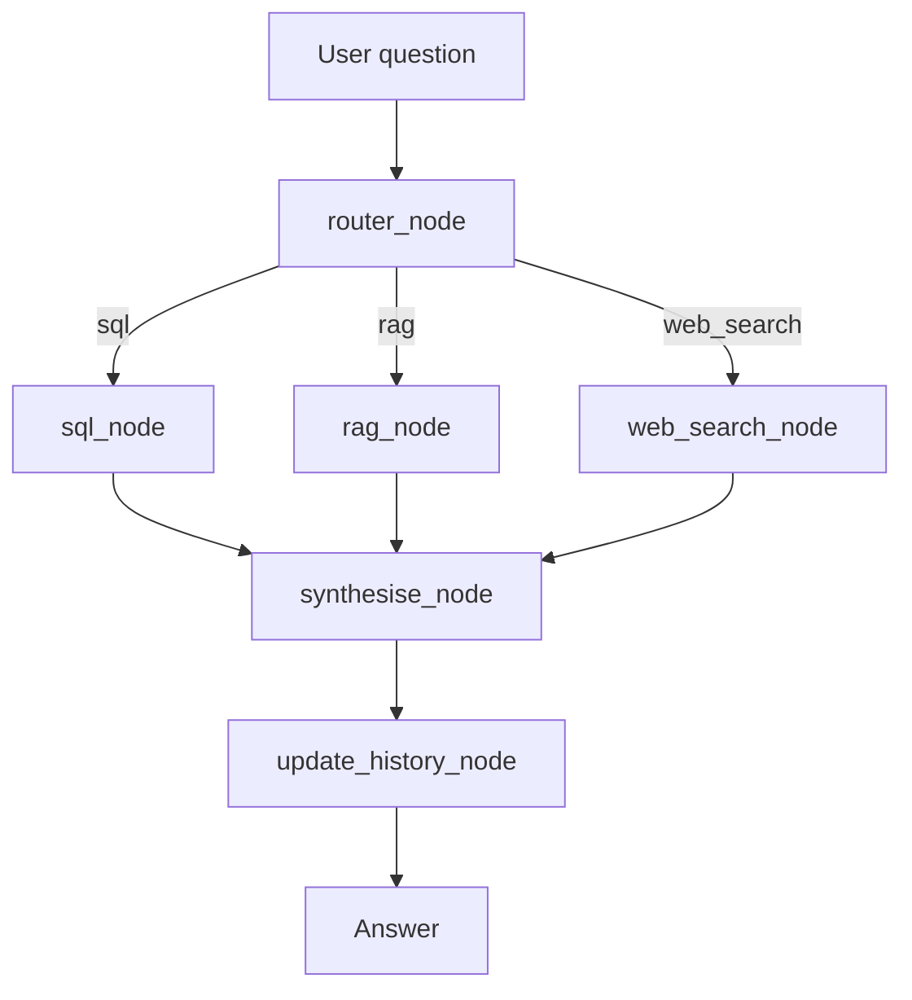

# End-to-End Tutorial: E-Commerce Agent with Observability [MLFlow]

⭐ Found this useful? Give the repo a star to support the project and future updates!

Read Complete [Medium Article Here](https://medium.com/@alphaiterations/mlflow-observability-for-generative-ai-a-deep-dive-with-text2sql-rag-websearch-using-langgraph-2430c502adfa?postPublishedType=initial)


A production-ready **agentic system** for analyzing e-commerce data through natural language. The system automatically determines the best tool for each user question:

- **SQL Route** — Query structured e-commerce databases for analytics
- **RAG Route** — Search through uploaded PDF documents (policies, guides, FAQs)
- **Web Search Route** — Real-time internet search for external information

Built with LangGraph, OpenAI, FAISS, and Tavily, with full multi-turn conversation context.

---

## 1. What This Project Does

`genai-observability` is an e-commerce conversational agent that:

- routes each user question to the best tool,
- answers analytical SQL questions from a local SQLite database,
- retrieves relevant text from uploaded PDFs using FAISS vector search,
- performs live web search using Serper when external information is needed,
- logs observability traces with MLflow for every step.

The agent is implemented as a LangGraph state machine with clearly separated nodes for routing, tools, synthesis, and conversation history.

---

## 2. Prerequisites

Before you begin, make sure you have:

1. Python 3.11 or newer installed.
2. `pip` available.
3. A working internet connection for data download and API calls.
4. OpenAI API key.
5. Serper API key for web search.

The repository already includes the main source files and configuration.


### Exact repository structure

```text
.
├── .env
├── .gitignore
├── README.md
├── agent
│   ├── __init__.py
│   ├── graph.py
│   ├── nodes.py
│   ├── router.py
│   └── state.py
├── config.py
├── data
│   ├── ecommerce.db
│   ├── faiss_index
│   │   ├── index.faiss
│   │   └── metadata.pkl
│   └── raw
│       ├── df_Customers.csv
│       ├── df_OrderItems.csv
│       ├── df_Orders.csv
│       ├── df_Payments.csv
│       └── df_Products.csv
├── data_loader.py
├── main.py
├── medium_tutorial.md
├── mlflow.db
├── observability.py
├── pdf_docs
│   └── shopbr_return_policy.pdf
├── requirements.txt
├── session.py
├── setup.py
└── tools
    ├── __init__.py
    ├── rag_tool.py
    ├── sql_tool.py
    └── web_search_tool.py
```

---

## 3. Setup Step-by-Step

### Step 1: Clone or open the repo

If you already have the repo open, skip this step. Otherwise:

```bash
git clone https://github.com/alphaiterations/agentic-ai-usecases.git
cd agentic-ai-usecases/advanced/genai-observability
```

### Step 2: Install Python dependencies

Install the required libraries from `requirements.txt`.

```bash
pip install -r requirements.txt
```

This installs the packages that power the agent, including:

- `openai`
- `langgraph`
- `faiss-cpu`
- `sentence-transformers`
- `pypdf`
- `pandas`
- `kagglehub`
- `mlflow`
- `python-dotenv`

### Step 3: Configure your API keys

Open `config.py` and use environment variables for keys.

```python
OPENAI_API_KEY  = os.getenv("OPENAI_API_KEY", "")
SERPER_API_KEY  = os.getenv("SERPER_API_KEY", "")
```


create a `.env` file in the repo root with:

```text
OPENAI_API_KEY=sk-...
SERPER_API_KEY=...
MLFLOW_TRACKING_URI=http://localhost:5001
MLFLOW_EXPERIMENT=ecommerce-agent
```

### Step 4: Run `setup.py`

The setup script does two things:

1. downloads the Kaggle e-commerce dataset,
2. ingests CSV files into SQLite,
3. builds the FAISS index from PDFs.

Run:

```bash
python setup.py
```

If you need to rebuild the database or the index, run:

```bash
python setup.py --force
```

### Step 5: Verify the data ingestion

The script writes the SQLite file to `data/ecommerce.db` and copies raw CSV files into `data/raw`.

The corresponding code is in `data_loader.py`:

- `TABLE_HINTS` maps dataset filenames to SQLite tables.
- `download_and_ingest()` downloads the dataset and writes tables.
- `list_tables()` confirms the tables in the database.

The expected tables are:

- `orders`
- `order_items`
- `customers`
- `payments`
- `products`

### Step 6: Add PDF documents for RAG (optional but recommended)

Place PDF files into the repo folder `pdf_docs/`.

Then rerun:

```bash
python setup.py --force
```

The repository builds the FAISS vector index in `data/faiss_index/` using `tools/rag_tool.py`.

---

## 4. Run the Agent

There are two ways to run the agent from `main.py`.

### Interactive mode

```bash
python main.py
```

This opens a REPL-style session. Enter questions, and the agent will respond using the appropriate route.

### Demo mode

```bash
python main.py --demo
```

Demo mode runs a hard-coded script that exercises:

- SQL route,
- web search route,
- RAG route.

---

## 5. Architecture Overview

The agent is implemented with a state graph in `agent/graph.py`.

### High-level flow



### What each node does

- `router_node` decides the route using `agent/router.py`.
- `sql_node` invokes `tools/sql_tool.py`.
- `rag_node` invokes `tools/rag_tool.py`.
- `web_search_node` invokes `tools/web_search_tool.py`.
- `synthesise_node` combines tool output into a final answer.
- `update_history_node` appends the turn to conversation history.

---

## 6. Core Files and What They Do

### `config.py`

This is the central configuration file:

- API keys (`OPENAI_API_KEY`, `SERPER_API_KEY`)
- model settings (`LLM_MODEL`, `LLM_TEMPERATURE`, `LLM_MAX_TOKENS`)
- embedding model (`EMBEDDING_MODEL`)
- file paths (`DB_PATH`, `RAW_DATA_DIR`, `FAISS_INDEX_DIR`, `PDF_DIR`)
- RAG settings (`RAG_TOP_K`, `CHUNK_SIZE`, `CHUNK_OVERLAP`)
- router route names: `ROUTES = ["sql", "rag", "web_search"]`

### `setup.py`

This script sets up the repository data and the FAISS index. It uses:

- `download_and_ingest(force=force)` from `data_loader.py`
- `build_index(force=force)` from `tools/rag_tool.py`

The script prints progress so you can verify each step.

### `data_loader.py`

This file handles dataset ingestion and raw data management.

**Key Functions:**

#### `download_and_ingest(force: bool = False)`

Downloads the e-commerce dataset from Kaggle and processes it:

1. **Creates directories**: Ensures `data/raw/` and database directory exist
2. **Downloads dataset**: Fetches the Kaggle e-commerce dataset if not already present
3. **Copies CSV files to `data/raw/`**: Extracts raw CSV files to the `data/raw/` folder:
   - `df_Customers.csv` – Customer information
   - `df_Orders.csv` – Order details
   - `df_OrderItems.csv` – Individual order line items
   - `df_Payments.csv` – Payment information
   - `df_Products.csv` – Product catalog
4. **Normalizes columns**: Cleans column names and data types
5. **Writes to SQLite**: Ingests normalized data into `data/ecommerce.db`
6. **Resolves delivery date variations**: Handles different date column formats across datasets

**Key behavior:**

- downloads the Kaggle dataset using `kagglehub.dataset_download`
- copies CSVs into `data/raw` with original filenames preserved
- normalizes columns and writes tables into SQLite
- resolves delivery date column variations
- skips re-download if `data/ecommerce.db` exists (unless `force=True`)

#### Raw Data Folder Structure

After running `data_loader.py`, the `data/raw/` folder contains:

```
data/raw/
├── df_Customers.csv        (Customer records)
├── df_Orders.csv           (Order headers)
├── df_OrderItems.csv       (Order line items)
├── df_Payments.csv         (Payment records)
└── df_Products.csv         (Product catalog)
```

These CSV files serve as the source of truth for the SQLite database and can be used for data inspection or manual verification.

#### Related Functions:

- `list_tables()` – Returns all table names from the SQLite database
- `TABLE_HINTS` – Maps CSV filenames to SQLite table names

**Example usage:**

```python
from data_loader import download_and_ingest, list_tables

# Download dataset and populate data/raw/ + SQLite
db_path = download_and_ingest(force=False)

# Verify tables were created
tables = list_tables()
print(tables)  # ['customers', 'orders', 'order_items', 'payments', 'products']
```

### `tools/sql_tool.py`

This tool is responsible for SQL analytics.

Flow:

1. Build a system prompt with table schema and join hints.
2. Call OpenAI to generate raw SQLite SQL.
3. Execute the SQL against `data/ecommerce.db`.
4. Return both raw rows and markdown-formatted results.

Important rules in code:

- `SELECT *` is forbidden.
- use `LIMIT 50` unless the user explicitly asks for all rows.
- `strftime('%Y-%m', order_purchase_timestamp)` is the recommended date filter syntax.

Example snippet:

```python
response = client.chat.completions.create(
    model=LLM_MODEL,
    messages=messages,
    temperature=LLM_TEMPERATURE,
    max_tokens=512,
)
```

### `tools/rag_tool.py`

This tool builds and queries a FAISS vector index for PDF text.

Key steps:

- extract text from PDFs using `PdfReader`
- split text into overlapping chunks
- encode chunks with `sentence-transformers/all-MiniLM-L6-v2`
- index chunks in FAISS
- retrieve the top `RAG_TOP_K` chunks for each query

The main query entry point is:

```python
result = run_rag_tool(user_question, conversation_history)
```

### `tools/web_search_tool.py`

This tool sends live search queries to the Serper API.

It returns structured search results in the form:

```python
{
  "results": [
    {"title": ..., "url": ..., "content": ...},
  ],
  "query": user_question,
}
```

### `agent/graph.py`

This file defines the LangGraph state machine.

- `build_graph()` registers nodes and creates conditional routing.
- `_route_selector(state)` maps `state["route"]` to the correct node.

The agent graph is compiled once per session and then invoked for every question.

### `agent/nodes.py`

This file contains the node implementations.

Example responsibilities:

- `router_node()` calls `route_question()` to choose `sql`, `rag`, or `web_search`.
- `sql_node()` calls `run_sql_tool()`.
- `rag_node()` calls `run_rag_tool()`.
- `web_search_node()` calls `run_web_search_tool()`.
- `synthesise_node()` builds a final answer with the LLM.
- `update_history_node()` appends the turn to history.

The synthesiser uses the same model for all routes and ensures the final answer is:

- clear,
- business-friendly,
- formatted with markdown when useful.

### `session.py`

This file manages the interactive session.

The `EcommerceSession` class:

- constructs the compiled graph with `build_graph()`
- maintains `conversation_history`
- increments `turn_number`
- wraps each turn in an observability trace span

Example usage:

```python
session = EcommerceSession()
answer = session.ask("What were total sales last month?")
```

### `observability.py`

This file adds MLflow tracing and cost/size tracking to the repo.

It provides:

- `trace()` decorator for tool and chain spans,
- `estimate_tokens()` and `calculate_cost()` helpers,
- byte-size estimation for inputs and outputs,
- automatic span attributes like `duration_ms`, `bytes.input`, and `cost.usd`.

Observability is enabled by default and logs each function invocation.

---

## 7. Detailed Execution Flow

### User question path

1. `main.py` starts the app and creates `EcommerceSession()`.
2. `session.ask(question)` increments the turn and opens a trace span.
3. `build_graph()` runs the `router_node` first.
4. The router chooses `sql_node`, `rag_node`, or `web_search_node`.
5. The selected tool node returns structured results.
6. `synthesise_node` formats the final answer.
7. `update_history_node` appends the user question and answer to history.
8. The response is returned to the user.

### Example route decisions

- SQL route: analytics queries about orders, customers, payments, products.
- RAG route: questions about PDF content like policies or manuals.
- Web search route: questions requiring up-to-date or internet-based information.

### Example question set

- SQL: `How many orders were delivered successfully?`
- SQL: `What is the average payment value for credit card transactions?`
- RAG: `What does our return policy say about electronics?`
- Web search: `What are the latest e-commerce trends in Brazil for 2024?`

---

## 8. Step-by-Step Commands Summary

```bash
# Install dependencies
pip install -r requirements.txt

# Set API keys
export OPENAI_API_KEY="sk-..."
export SERPER_API_KEY="..."

# Run setup once
python setup.py

# Start interactive agent
python main.py

# Or run demo mode
python main.py --demo
```

---

## 9. Practical Notes

- If you do not have PDFs in `pdf_docs/`, the agent still works for SQL and web search.
- The FAISS index is rebuilt from `pdf_docs/` only when `python setup.py --force` is used.
- The SQL tool relies on a fixed schema prompt in `tools/sql_tool.py`, so the dataset shape should remain unchanged.
- The router uses exact route labels: `sql`, `rag`, and `web_search`.

---

## 10. What to Change Next

If you want to extend the project, start with:

- adding more PDF documents to `pdf_docs/` for richer RAG answers,
- customizing `SCHEMA_DESCRIPTION` in `tools/sql_tool.py` for new business logic,
- improving the router prompt in `agent/router.py`,
- adding new observability metrics in `observability.py`.

---

## 11. Conclusion

This repo provides a complete end-to-end e-commerce analytics agent that is:

- easy to set up,
- powerful for SQL, document, and web search queries,
- observable through MLflow,
- built with a clean LangGraph routing architecture.


